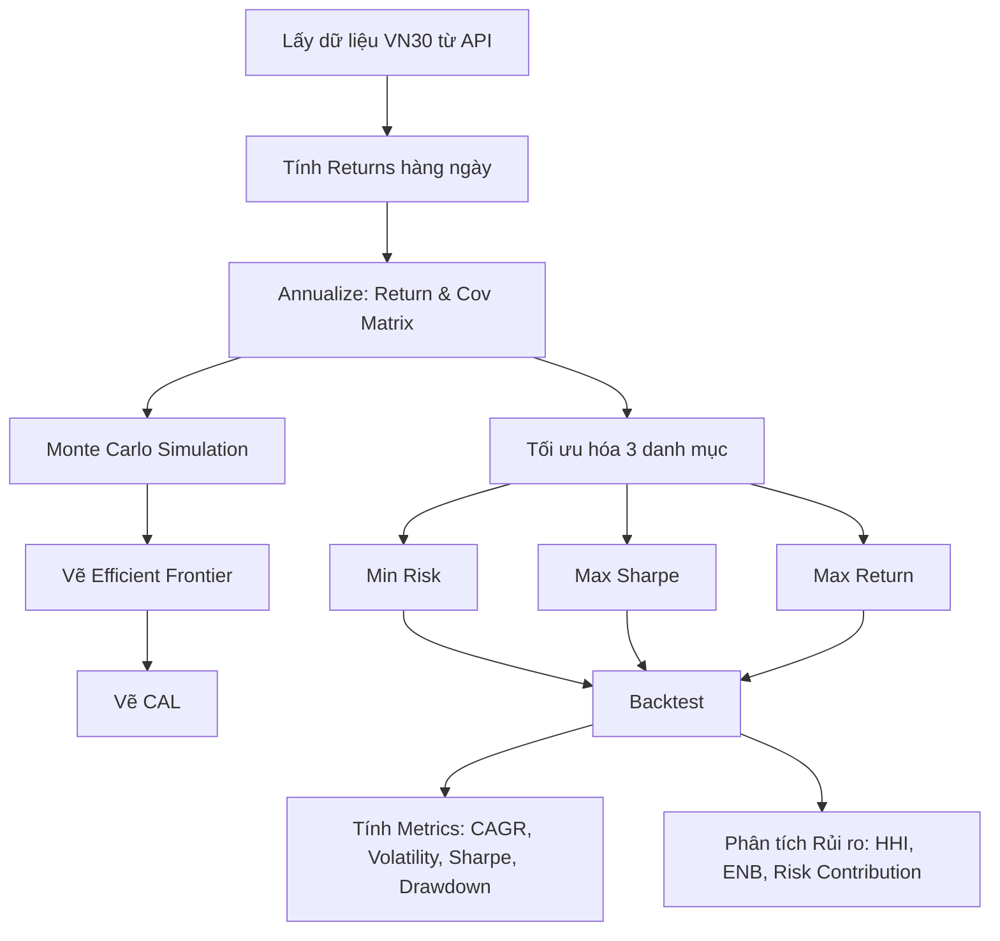

# 📊 Ứng dụng Phân tích & Tối ưu hóa Danh mục VN30

## 🎯 Tổng quan
Ứng dụng web tương tác được xây dựng bằng **Streamlit** để phân tích và tối ưu hóa danh mục đầu tư cho 30 cổ phiếu trong chỉ số VN30. Ứng dụng sử dụng **Lý thuyết Danh mục Hiện đại (Modern Portfolio Theory - MPT)** của Harry Markowitz để tìm ra các danh mục tối ưu theo các tiêu chí khác nhau.

---

## 🧮 Các Logic và Phương pháp Tính toán

### 1️⃣ Thu thập & Xử lý Dữ liệu

#### **1.1. Lấy dữ liệu lịch sử giá**
```python
def get_price_history_api(symbol, start_date, end_date)
```
- **Nguồn dữ liệu**: API CafeF.vn
- **Phương pháp**: Phân trang (pagination) để lấy toàn bộ dữ liệu lịch sử
- **Điều chỉnh giá**: Sử dụng `GiaDieuChinh` (adjusted price) để tính toán chính xác
  - Tính tỷ lệ điều chỉnh: `adjustment_ratio = GiaDieuChinh / GiaDongCua`
  - Điều chỉnh OHLC: Nhân tất cả giá với `adjustment_ratio`

#### **1.2. Cache dữ liệu**
- Lưu trữ dữ liệu vào file **Parquet** để tối ưu hiệu suất
- Chỉ gọi API khi không có cache hoặc người dùng yêu cầu làm mới

---

### 2️⃣ Tính toán Tỷ suất Sinh lời

#### **2.1. Tỷ suất sinh lời hàng ngày**
```python
returns_df = price_pivot.pct_change()
```
**Công thức**:
$$R_t = \frac{P_t - P_{t-1}}{P_{t-1}}$$

Trong đó:
- $R_t$: Tỷ suất sinh lời tại thời điểm $t$
- $P_t$: Giá tại thời điểm $t$
- $P_{t-1}$: Giá tại thời điểm $t-1$

#### **2.2. Annualize (Hóa năm)**
```python
expected_returns = returns_df.mean() * he_so_scale
cov_matrix = returns_df.cov() * he_so_scale
```
**Công thức**:
- **Lợi nhuận kỳ vọng năm**: $E[R_{annual}] = E[R_{daily}] \times 252$
- **Ma trận hiệp phương sai năm**: $\Sigma_{annual} = \Sigma_{daily} \times 252$

Trong đó:
- 252: Số ngày giao dịch trong 1 năm
- 126: Số ngày giao dịch trong 6 tháng
- 504: Số ngày giao dịch trong 2 năm

---

### 3️⃣ Tối ưu hóa Danh mục (Portfolio Optimization)

#### **3.1. Hàm mục tiêu và ràng buộc**

##### **A. Tính toán chỉ số danh mục**
```python
def get_portfolio_stats(weights, expected_returns, cov_matrix, risk_free_rate):
    port_return = np.sum(weights * expected_returns)
    port_risk = np.sqrt(np.dot(weights.T, np.dot(cov_matrix, weights)))
    port_sharpe = (port_return - risk_free_rate) / port_risk
    return (port_return, port_risk, port_sharpe)
```

**Công thức**:

1. **Lợi nhuận danh mục**:
$$R_p = \sum_{i=1}^{n} w_i \times E[R_i]$$

2. **Rủi ro danh mục** (Độ lệch chuẩn):
$$\sigma_p = \sqrt{w^T \Sigma w} = \sqrt{\sum_{i=1}^{n}\sum_{j=1}^{n} w_i w_j \sigma_{ij}}$$

3. **Chỉ số Sharpe**:
$$\text{Sharpe Ratio} = \frac{R_p - R_f}{\sigma_p}$$

Trong đó:
- $w_i$: Tỷ trọng cổ phiếu $i$
- $E[R_i]$: Lợi nhuận kỳ vọng cổ phiếu $i$
- $\Sigma$: Ma trận hiệp phương sai
- $R_f$: Lãi suất phi rủi ro (risk-free rate)

##### **B. Ràng buộc tối ưu hóa**
```python
constraints = [
    {'type': 'eq', 'fun': lambda x: np.sum(x) - 1},  # Tổng = 100%
]
bounds = tuple((0.0, MAX_WEIGHT) for _ in range(num_assets))
```

**Các ràng buộc**:
1. **Ràng buộc đẳng thức**: $\sum_{i=1}^{n} w_i = 1$ (Tổng tỷ trọng = 100%)
2. **Ràng buộc bất đẳng thức**: 
   - $0 \leq w_i \leq \text{MAX\_WEIGHT}$ (Mỗi cổ phiếu tối đa 30% mặc định)
   - Số lượng cổ phiếu $\geq$ min_stocks (Tối thiểu 5 cổ phiếu)

---

#### **3.2. Ba chiến lược tối ưu hóa**

##### **🛡️ A. Danh mục Bảo thủ (Minimum Risk)**

**Mục tiêu**: Tìm danh mục có rủi ro thấp nhất

**Hàm mục tiêu**:
```python
minimize: portfolio_risk = sqrt(w^T * Σ * w)
```

**Phương pháp**:
```python
opt_min_vol = minimize(
    minimize_portfolio_risk,
    initial_guess,
    method='SLSQP',
    bounds=bounds,
    constraints=constraints
)
```

**Thuật toán**: SLSQP (Sequential Least Squares Programming)
- Giải bài toán tối ưu phi tuyến có ràng buộc
- Tìm điểm cực tiểu của hàm rủi ro

**Fallback** (nếu không đủ cổ phiếu):
- Chọn top N cổ phiếu có rủi ro thấp nhất: $\text{argmin}_i(\sigma_{ii})$
- Phân bổ đều: $w_i = \frac{1}{N}$

---

##### **⚖️ B. Danh mục Cân bằng (Maximum Sharpe Ratio)**

**Mục tiêu**: Tối đa hóa tỷ lệ lợi nhuận trên rủi ro

**Hàm mục tiêu**:
```python
maximize: Sharpe Ratio = (R_p - R_f) / σ_p
equivalent to minimize: -Sharpe Ratio
```

**Phương pháp**:
```python
opt_max_sharpe = minimize(
    minimize_negative_sharpe,
    initial_guess,
    method='SLSQP',
    bounds=bounds,
    constraints=constraints
)
```

**Giải thích**:
- Danh mục này nằm trên **Đường biên hiệu quả (Efficient Frontier)**
- Tiếp điểm của **đường CAL (Capital Allocation Line)** với đường biên hiệu quả
- Cung cấp tỷ lệ risk-reward tốt nhất

**Fallback**:
- Chọn top N cổ phiếu có lợi nhuận cao nhất
- Phân bổ đều

---

##### **🚀 C. Danh mục Mạo hiểm (Maximum Return)**

**Mục tiêu**: Tối đa hóa lợi nhuận (chấp nhận rủi ro cao hơn)

**Phương pháp**:
```python
# Chọn top N cổ phiếu có return cao nhất
top_n_returns_idx = np.argsort(-expected_returns)[:min_stocks]

# Phân bổ theo tỷ lệ lợi nhuận
weights[i] = returns[i] / sum(top_returns)
```

**Logic**:
1. Sắp xếp cổ phiếu theo lợi nhuận kỳ vọng giảm dần
2. Chọn top N cổ phiếu (N = min_stocks)
3. Phân bổ tỷ trọng theo tỷ lệ lợi nhuận (có giới hạn MAX_WEIGHT)
4. Chuẩn hóa để tổng = 100%

**Đa dạng hóa**:
- Không cho phép 100% vào 1 cổ phiếu (khác với cách tiếp cận truyền thống)
- Áp dụng giới hạn MAX_WEIGHT để giảm rủi ro tập trung

---

### 4️⃣ Mô phỏng Monte Carlo

```python
def run_monte_carlo_sim(n_sims, expected_returns, cov_matrix, risk_free_rate):
    np.random.seed(42)  # Cố định seed cho reproducibility
    
    for i in range(n_sims):
        weights = np.random.random(num_assets)
        weights /= np.sum(weights)  # Chuẩn hóa
        
        # Tính toán return, risk, sharpe
        ...
```

**Mục đích**:
- Tạo ra N (5000-50000) danh mục ngẫu nhiên
- Vẽ **đường biên hiệu quả** từ dữ liệu mô phỏng
- So sánh các danh mục tối ưu với không gian khả thi

**Thuật toán**:
1. Tạo N vector trọng số ngẫu nhiên
2. Chuẩn hóa mỗi vector để tổng = 1
3. Tính return, risk, Sharpe cho mỗi danh mục
4. Lưu trữ và trực quan hóa

---

### 5️⃣ Đường biên Hiệu quả (Efficient Frontier)

```python
def calculate_theoretical_efficient_frontier(mean_returns, cov_matrix, risk_free_rate):
    # Tìm danh mục min risk
    opt_min_vol = minimize(minimize_portfolio_risk, ...)
    min_ret_global = np.sum(mean_returns * opt_min_vol.x)
    max_ret_global = mean_returns.max()
    
    # Tạo các mục tiêu return từ min đến max
    target_returns = np.linspace(min_ret_global, max_ret_global, 100)
    
    for target in target_returns:
        # Tối ưu hóa với ràng buộc return = target
        constraints = [
            {'type': 'eq', 'fun': lambda x: np.sum(x) - 1},
            {'type': 'eq', 'fun': lambda x: np.sum(mean_returns * x) - target}
        ]
        opt = minimize(minimize_portfolio_risk, ..., constraints=constraints)
```

**Công thức toán học**:

Với mỗi mức lợi nhuận mục tiêu $R^*$:

$$\min_{w} \quad \sigma_p^2 = w^T \Sigma w$$

Thỏa mãn:
- $\sum w_i = 1$
- $\sum w_i E[R_i] = R^*$
- $0 \leq w_i \leq \text{MAX\_WEIGHT}$

**Kết quả**: Tập hợp các điểm (risk, return) tạo thành đường biên hiệu quả

---

### 6️⃣ Đường CAL (Capital Allocation Line)

```python
# CAL đi qua risk-free rate và danh mục Max Sharpe
x_cal = [0, sharpe_risk * 1.5]
y_cal = [R_f, R_f + (R_p - R_f) / σ_p * (sharpe_risk * 1.5)]
```

**Công thức**:
$$R_{CAL} = R_f + \frac{R_p - R_f}{\sigma_p} \times \sigma_{CAL}$$

Trong đó:
- Slope = Sharpe Ratio của danh mục tối ưu
- Điểm tiếp xúc với EF = Danh mục Max Sharpe

---

### 7️⃣ Backtest & Đánh giá Hiệu suất

#### **7.1. Tính toán lợi nhuận danh mục**
```python
def run_simple_backtest(daily_returns_df, portfolio_weights):
    port_returns_daily = daily_returns_df.dot(portfolio_weights)
    cumulative_returns = (1 + port_returns_daily).cumprod()
```

**Công thức**:
- **Return hàng ngày**: $R_{p,t} = \sum_{i=1}^{n} w_i \times R_{i,t}$
- **Cumulative return**: $\text{Cum}_t = \prod_{k=1}^{t} (1 + R_{p,k})$

#### **7.2. Các chỉ số đánh giá (sử dụng QuantStats)**

##### **A. CAGR (Compound Annual Growth Rate)**
```python
cagr = qs.stats.cagr(returns_series)
```
$$\text{CAGR} = \left(\frac{\text{Giá trị cuối}}{\text{Giá trị đầu}}\right)^{\frac{1}{\text{số năm}}} - 1$$

##### **B. Volatility (Độ biến động)**
```python
volatility = qs.stats.volatility(returns_series)
```
$$\text{Volatility} = \sigma_{annual} = \sigma_{daily} \times \sqrt{252}$$

##### **C. Maximum Drawdown**
```python
max_drawdown = qs.stats.max_drawdown(returns_series)
```
$$\text{Max DD} = \max_{t} \left(\frac{\text{Peak}_t - \text{Price}_t}{\text{Peak}_t}\right)$$

Trong đó $\text{Peak}_t = \max_{k \leq t} \text{Price}_k$

##### **D. Sharpe Ratio (Historical)**
```python
sharpe = qs.stats.sharpe(returns_series, rf=risk_free_rate)
```
$$\text{Sharpe} = \frac{\text{mean}(R_p) - R_f}{\text{std}(R_p)} \times \sqrt{252}$$

---

### 8️⃣ Phân tích Rủi ro & Đa dạng hóa

#### **8.1. Herfindahl Index (Chỉ số tập trung)**
```python
herfindahl = (weights ** 2).sum()
```

**Công thức**:
$$HHI = \sum_{i=1}^{n} w_i^2$$

**Giải thích**:
- $HHI = 1$: Tập trung hoàn toàn (100% vào 1 cổ phiếu)
- $HHI = 1/n$: Phân bổ đều (mỗi cổ phiếu $1/n$)
- $HHI \to 0$: Đa dạng hóa tốt

#### **8.2. Effective Number of Bets (ENB)**
```python
enb = 1 / herfindahl
```

**Công thức**:
$$ENB = \frac{1}{\sum_{i=1}^{n} w_i^2}$$

**Ý nghĩa**: Số lượng cổ phiếu "độc lập tương đương" trong danh mục

#### **8.3. Risk Contribution (Đóng góp rủi ro)**

```python
portfolio_variance = np.dot(weights.T, np.dot(cov_matrix, weights))
portfolio_std = np.sqrt(portfolio_variance)

marginal_contrib = np.dot(cov_matrix, weights) / portfolio_std
contrib_to_risk = weights * marginal_contrib
```

**Công thức**:

1. **Marginal Contribution to Risk**:
$$\text{MCR}_i = \frac{\partial \sigma_p}{\partial w_i} = \frac{(\Sigma w)_i}{\sigma_p}$$

2. **Total Contribution to Risk**:
$$\text{CR}_i = w_i \times \text{MCR}_i$$

3. **Risk Contribution (%)**:
$$\text{RC}_i = \frac{\text{CR}_i}{\sum_{j} \text{CR}_j}$$

**Ý nghĩa**: 
- Đo lường % rủi ro mà mỗi cổ phiếu đóng góp vào tổng rủi ro danh mục
- Nếu $\text{RC}_i >> w_i$ → Cổ phiếu này có tương quan cao với các cổ phiếu khác

---

## 🛡️ Nguyên tắc "Không bỏ hết trứng vào 1 giỏ"

### **Cách triển khai**:

1. **Giới hạn tỷ trọng tối đa** (MAX_WEIGHT):
   - Mặc định: 30%
   - Có thể điều chỉnh: 5% - 100%
   - Đảm bảo: $w_i \leq 0.30, \forall i$

2. **Số cổ phiếu tối thiểu** (min_stocks):
   - Mặc định: 5 cổ phiếu
   - Có thể điều chỉnh: 3 - 30
   - Đảm bảo: $|\{i : w_i > 0.001\}| \geq 5$

3. **Fallback mechanism**:
   ```python
   if np.sum(weights > 0.001) < min_stocks:
       # Chọn top N cổ phiếu theo tiêu chí
       # Phân bổ đều hoặc theo tỷ lệ
   ```

### **Lợi ích**:
- ✅ Giảm rủi ro tập trung
- ✅ Tăng tính ổn định của danh mục
- ✅ Giảm tác động của cổ phiếu đơn lẻ
- ✅ Tuân thủ nguyên tắc đa dạng hóa

---

## 📊 Quy trình Tổng thể



---

## 🔧 Công nghệ Sử dụng

- **Python 3.12**
- **Streamlit**: Framework web app
- **Pandas & NumPy**: Xử lý dữ liệu
- **SciPy**: Thuật toán tối ưu (SLSQP)
- **Plotly**: Trực quan hóa tương tác
- **QuantStats**: Tính toán metrics tài chính
- **PyArrow**: Cache dữ liệu hiệu quả

---

## 📈 Cách Sử dụng

### **Cài đặt**:
```bash
pip install -r requirements.txt
```

### **Chạy ứng dụng**:
```bash
cd Demacia
streamlit run app.py
```

### **Truy cập**:
- Local: http://localhost:8501
- Network: http://[your-ip]:8501

---

## 📚 Tài liệu Tham khảo

1. **Markowitz, H.** (1952). "Portfolio Selection". *Journal of Finance*, 7(1), 77-91.
2. **Sharpe, W.F.** (1966). "Mutual Fund Performance". *Journal of Business*, 39(1), 119-138.
3. **Modern Portfolio Theory** - Wikipedia
4. **QuantStats Documentation** - https://github.com/ranaroussi/quantstats
5. **Scipy Optimization** - https://docs.scipy.org/doc/scipy/reference/optimize.html

---

## 👨‍💻 Tác giả

Đồ án môn học - Tối ưu hóa Danh mục Đầu tư VN30

---

## 📝 License

Educational purposes only - Chỉ sử dụng cho mục đích học tập

---

## 🚀 Tính năng Nổi bật

✅ **4 Tab phân tích chuyên sâu**:
- 📊 Dữ liệu & Tương quan
- 🎯 Tỷ trọng & Đường biên
- 📈 Backtest & Hiệu suất
- 🛡️ Phân tích Rủi ro & Đa dạng

✅ **Trực quan hóa đẹp mắt**:
- Heatmap tương quan
- Biểu đồ phân phối
- Đường biên hiệu quả
- Biểu đồ tròn/cột/đường
- Phân tích Drawdown
- Ma trận Risk-Return

✅ **Tối ưu hóa thông minh**:
- 3 chiến lược đầu tư
- Giới hạn đa dạng hóa tùy chỉnh
- Thuật toán SLSQP hiệu quả

✅ **Cache thông minh**:
- Lưu trữ Parquet
- Đa luồng khi gọi API
- Tốc độ xử lý nhanh
